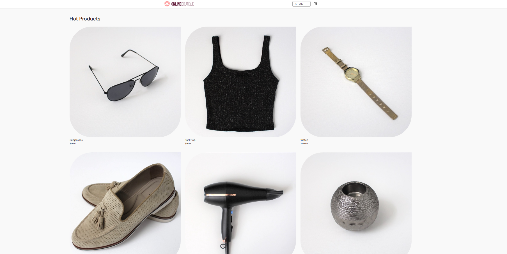
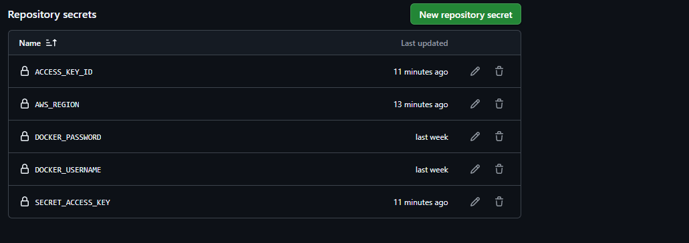
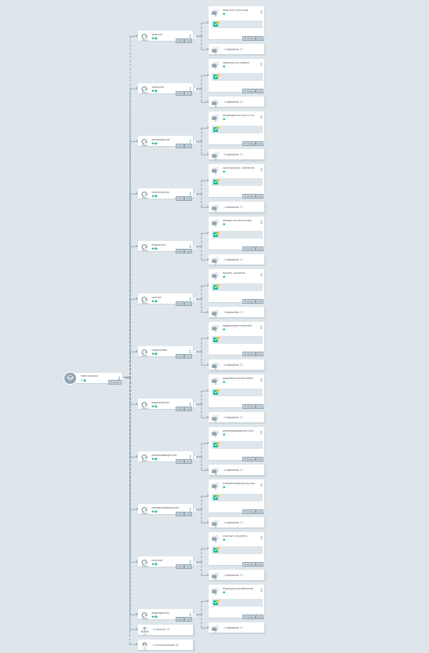
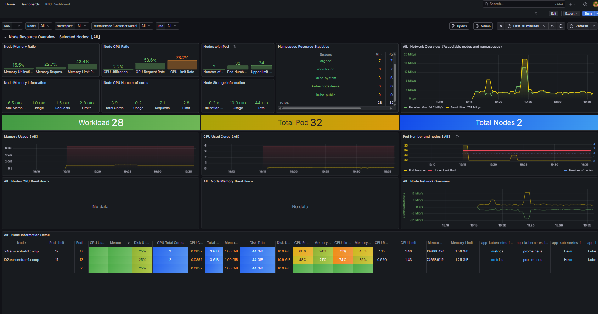

# 🚀 Advanced Infrastructure for Online Boutique (DevOps & GitOps)

Welcome to this comprehensive project focused on building a robust, secure, and scalable infrastructure for Microservices applications using the latest DevOps tools and GitOps best practices.

---

## 🏗️ Phase 1: Infrastructure Foundation

In this phase, the core cloud foundation was established to ensure high availability and security using Infrastructure as Code (IaC):

* **AWS Environment Setup:** Provisioned a Virtual Private Cloud (VPC), Subnets, and IAM roles. State management was handled using **S3 and DynamoDB** as a backend for **Terraform**.
* **EKS Cluster Provisioning:** Built and configured a production-ready **Amazon EKS Cluster**, including managed **Node Groups** to handle container workloads with elasticity.

---

## 🔐 Phase 2: Secrets & Core Configuration

This phase focuses on deep security for sensitive data and managing traffic flow into the cluster:

* **Secrets Management:** Implemented **AWS Secrets Manager** integrated with **External Secrets Operator (ESO)** inside EKS to securely inject secrets into pods without manual intervention.
* **Traffic Routing:** Configured the **Ingress Controller** to manage and route external traffic (Ingress/Egress) to the appropriate services efficiently.

---

## ⚙️ Phase 3: Continuous Delivery (CI/CD & GitOps)

Automating the development lifecycle to ensure rapid and reliable deployments through GitOps methodologies:

* **CI/CD Pipelines:** Leveraged **GitHub Actions** for building and testing **Docker** images (stored in **ECR/DockerHub**), and **ArgoCD** for continuous deployment, ensuring the cluster state matches the Git repository.
* **Package Management:** Authored custom **Helm Charts** for the Online Boutique microservices to standardize deployments across different environments.

---

## 📊 Phase 4: Full-Stack Observability

Establishing deep visibility into system performance and facilitating real-time troubleshooting:

* **LGTM Stack Deployment:** Implemented the full **LGTM Stack** (Loki for logs, **Grafana** for dashboards, Tempo for tracing, and Mimir for metrics).
* **Distributed Tracing & Metrics:** Configured **OpenTelemetry (OTel)** to collect and export Metrics, Traces, and Logs from the applications to our monitoring backend for comprehensive insights.

