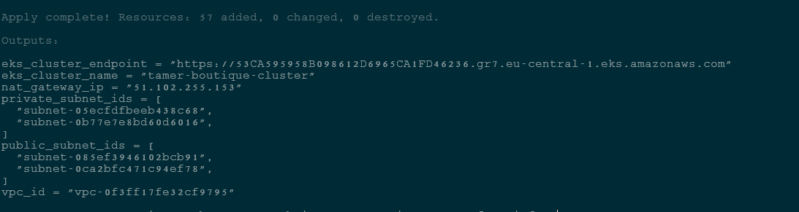
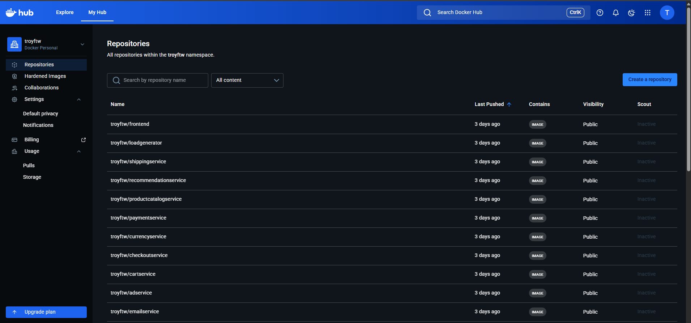
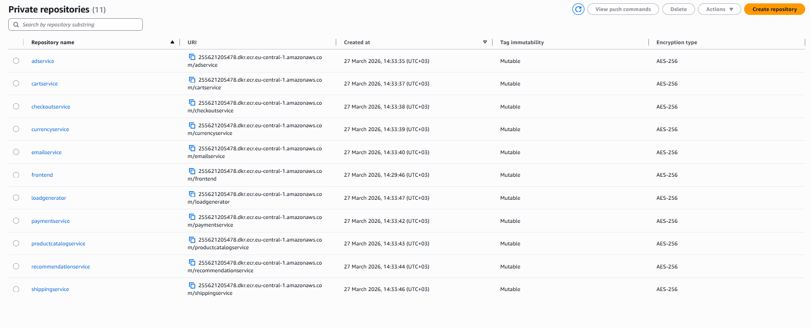
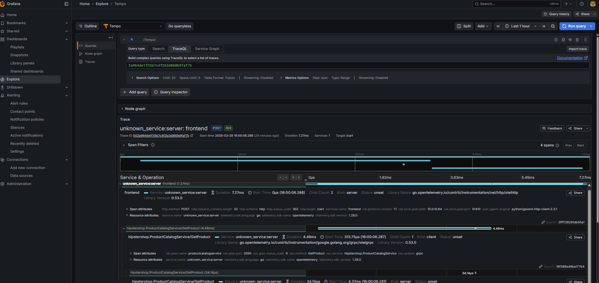

# Online Boutique: End-to-End DevOps Pipeline

This project showcases a complete, production-grade microservices deployment lifecycle, designed to highlight cloud-native architecture, infrastructure automation, and robust observability.

## 🖥️ Final Application Interface

The final output is a fully functional e-commerce application, featuring a smooth user experience and deployed across an automated, highly available AWS EKS cluster.

*The interface focuses on clear hierarchy and a reliable backend powered by microservices.*

## 🛠️ Tech Stack & Key Features

* **Infrastructure as Code (IaC):** AWS environment provisioned securely with Terraform.
* **GitOps & CI/CD:** Automated deployments using GitHub Actions and ArgoCD.
* **Container Registries:** Dual-registry setup utilizing Docker Hub and AWS ECR.
* **Deep Observability:** Comprehensive monitoring and distributed tracing using Grafana and Tempo.

## 🧩 Key Application Components

The following images illustrate key components of the development process, infrastructure provisioning, and tool integration:

*  
*  
*  
* 

### Component Details:

Each component serves a specific role in the overall application workflow, from secure secret management and infrastructure creation to continuous deployment and granular system monitoring, ensuring easy maintenance and scalability.
